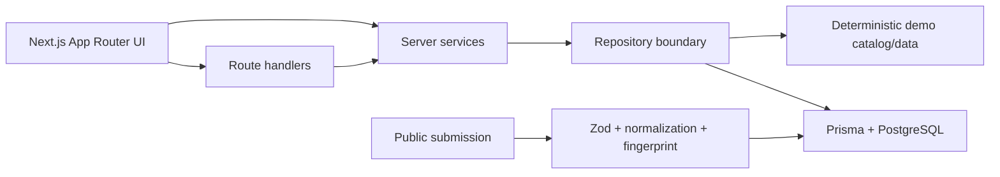

# CompGrid

CompGrid is a compensation-intelligence MVP for the Indian technology market. It helps people compare annual INR packages across companies, company-specific levels, canonical career levels, roles, and cities—while keeping assumptions and uncertainty visible.

The main experience is at `/explore`: filter the market, inspect percentile metrics, sort individual records, open a company profile, compare levels, or anonymously submit a normalized package.

## Product thesis

Compensation data is difficult to compare because the same title means different things across employers, equity is reported inconsistently, and city/role mix can distort a single headline number. CompGrid addresses this by:

- preserving raw company levels such as Google L4, Amazon L5, and Microsoft 63;
- mapping those levels to a directional shared ladder (`ENTRY` through `DISTINGUISHED`);
- deriving total compensation as base + annual stock + annual bonus;
- showing median, quartiles, p90, min, max, and sample size instead of one “market rate”;
- labeling deterministic demo records and keeping public submissions anonymous and initially unverified.

## Routes

| Route | Purpose |
| --- | --- |
| `/explore` | URL-backed compensation explorer with filters, metrics, sorting, pagination, and responsive cards |
| `/companies` | Searchable company directory |
| `/companies/[slug]` | Company profile, role/location slice, level mapping, and median chart |
| `/compare` | Compare up to three company levels on the same role and city |
| `/submit` | Anonymous INR submission form with live derived total |
| `/methodology` | Normalization, level mapping, and metric definitions |
| `/research` | Research questions, competitor context, and disclosures |

## Architecture



The web app uses Next.js 16, React 19, TypeScript strict mode, Tailwind CSS, shadcn-style primitives, Prisma 7, PostgreSQL, Zod, React Hook Form, Recharts, Lucide, Vitest, and Playwright-ready scripts. When `DATABASE_URL` is absent, read paths use the deterministic demo repository so the product can be explored locally without a database.

## API

- `GET /api/compensations` — validated filters, pagination, records, and total-compensation aggregates.
- `GET /api/companies` — searchable directory.
- `GET /api/companies/[slug]` — company summary and mapped levels.
- `GET /api/companies/[slug]/levels` — level analytics.
- `GET /api/comparison` — comparison data for up to three level tokens.
- `GET /api/roles` and `GET /api/locations` — catalog options.
- `POST /api/submissions` — validates, normalizes, derives total compensation, rate-limits, and returns `201` or a structured error.

Errors use a stable envelope: `{ "error": { "code": "...", "message": "...", "details": {} } }`. Duplicate fingerprints return `409`.

## Data model and semantics

The Prisma schema contains `Company`, `CompanyAlias`, `Role`, `RoleAlias`, `CareerLevel`, `CompanyLevel`, `Location`, and `CompensationSubmission`.

- Money is stored as integer INR; no floating-point money is persisted.
- Names use Unicode normalization, lowercasing, punctuation cleanup, and whitespace folding.
- Aliases resolve company/role submissions without changing canonical catalog names.
- A SHA-256 fingerprint combines the resolved foreign keys, year, compensation components, and experience to make duplicates idempotently rejectable.
- Stock and bonus are annualized estimates and should not be interpreted as cash-equivalent guarantees.

## Local setup

```bash
pnpm install
copy apps\\web\\.env.example apps\\web\\.env.local
pnpm dev
```

The frontend is available at `http://localhost:3000`; the existing health app is available at `http://localhost:3001/server`.

For PostgreSQL-backed mode, set `DATABASE_URL` in `apps/web/.env.local`, then run:

```bash
pnpm --filter @comp-intel/web db:generate
pnpm --filter @comp-intel/web db:migrate
pnpm --filter @comp-intel/web db:seed
```

The seed creates the catalog and 5,760 deterministic synthetic records (20 companies × 4 roles × 6 cities × 12 observations). The seed requires PostgreSQL and never presents synthetic values as verified community evidence.

## Verification

```bash
pnpm lint
pnpm typecheck
pnpm test
pnpm build
pnpm --filter @comp-intel/web test:e2e
```

Unit and API tests cover normalization, derived compensation, fingerprint uniqueness, percentile statistics, demo data, validation, repositories, and route behavior. Browser tests require Playwright browsers to be installed in the environment.

## Deployment and limitations

Deploy `apps/web` as a Next.js application with a managed PostgreSQL database. Configure `DATABASE_URL` and `NEXT_PUBLIC_APP_URL`, run migrations during release, and seed only the intended environment. Use connection pooling for serverless deployments and keep Prisma migrations under version control.

This MVP does not verify employment, offer letters, grant terms, or identities; it does not model tax, vesting schedules, refresh grants, joining bonuses, or remote-location nuance. Canonical levels are a research aid, not a claim of equivalence. A production launch should add moderation, abuse controls beyond the process-local rate limit, provenance fields, confidence intervals, and an admin review workflow.

## Tradeoffs and next steps

The repository boundary deliberately supports demo mode and PostgreSQL mode behind the same services, which keeps the UI testable but means demo and production persistence have different durability characteristics. The next useful increments are authenticated moderation, richer equity semantics, confidence/sample-quality indicators, saved comparisons, and a dedicated ingestion pipeline.
