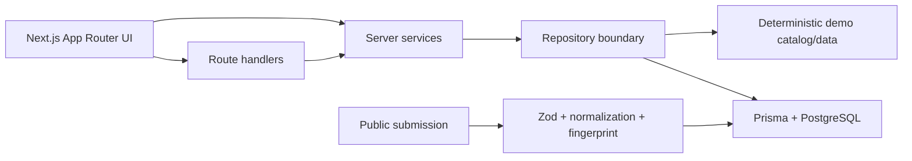

# CompGrid

CompGrid is a compensation-intelligence MVP for the Indian technology market. It helps people compare annual INR packages across companies, company-specific levels, canonical career levels, roles, and cities—while keeping assumptions and uncertainty visible.

The main experience is at `/explore`: filter the market, inspect percentile metrics, sort individual records, open a company profile, compare levels, or anonymously submit a normalized package.

## Product thesis

Compensation data is difficult to compare because the same title means different things across employers, equity is reported inconsistently, and city/role mix can distort a single headline number. CompGrid addresses this by:

- preserving raw company levels such as Google L4, Amazon L5, and Microsoft 63;
- mapping those levels to a directional shared ladder (`ENTRY` through `DISTINGUISHED`);
- deriving total compensation as base + annual stock + annual bonus;
- showing median, quartiles, p90, min, max, and sample size instead of one “market rate”;
- labeling deterministic demo records and keeping public submissions anonymous and initially unverified.

## Routes

| Route | Purpose |
| --- | --- |
| `/explore` | URL-backed compensation explorer with filters, metrics, sorting, pagination, and responsive cards |
| `/companies` | AI company discovery with search, categories, filters, sorting, pagination, and responsive cards |
| `/companies/[slug]` | AI company profile with products, capabilities, metadata, and related companies; legacy compensation profiles remain supported |
| `/compare` | Compare up to three company levels on the same role and city |
| `/submit` | Anonymous INR submission form with live derived total |
| `/methodology` | Normalization, level mapping, and metric definitions |
| `/research` | Research questions, competitor context, and disclosures |
| `/robots.txt` | Crawler rules and the sitemap URL |
| `/sitemap.xml` | Static pages and public company profile URLs |
| `/opengraph-image` | Generated 1200 × 630 social preview image |
fix error
2nd bug

## Architecture



The web app uses Next.js 16, React 19, TypeScript strict mode, Tailwind CSS, shadcn-style primitives, Prisma 7, PostgreSQL, Zod, React Hook Form, Recharts, Lucide, Vitest, and Playwright-ready scripts. When `DATABASE_URL` is absent, read paths use the deterministic demo repository so the product can be explored locally without a database.

### AI Companies module

The `/companies` module is a server-rendered discovery surface for a deterministic 48-company AI ecosystem catalog. It uses the same compact CompGrid design language—neutral cards, restrained accent color, badges, and URL-backed discovery controls—while adding AI-specific metadata and product depth.

The listing query supports `search`, `category`, `country`, `status`, `sort`, `page`, and `limit`. Server Components call `getAiCompanyDirectory` directly; the public route handler exposes the same service for API consumers. The no-database fallback and PostgreSQL repository implement the same filtering, sorting, pagination, and related-company ranking behavior.

All AI company descriptions, products, popularity scores, and relationships are deterministic evaluation/demo content. They are not live company intelligence or verified market claims.

## API

All endpoints are relative to the web application origin. Read endpoints use the deterministic synthetic repository when `DATABASE_URL` is not configured; PostgreSQL-backed deployments use the same response contracts.

### Response and error conventions

Successful collection endpoints wrap their result in `{ "data": ... }`. Compensation money values are integer INR amounts, not floating-point values. The explorer and comparison views format those values as lakh/crore amounts for display.

Every handled error uses the following envelope:

```json
{
  "error": {
    "code": "VALIDATION_ERROR",
    "message": "Please check the submitted values",
    "details": {}
  }
}
```

Possible error codes are `VALIDATION_ERROR`, `NOT_FOUND`, `DUPLICATE_SUBMISSION`, `UNSUPPORTED_CURRENCY`, `DATABASE_ERROR`, `RATE_LIMITED`, and `INTERNAL_ERROR`.

### `GET /api/compensations`

Returns a filtered, sorted, paginated compensation slice and aggregates for the full filtered set.

| Query parameter | Type | Description |
| --- | --- | --- |
| `company` | string | Company slug, for example `google`. |
| `role` | string | Role slug, for example `software-engineer`. |
| `level` | enum | `ENTRY`, `MID`, `SENIOR`, `STAFF`, `PRINCIPAL`, or `DISTINGUISHED`. |
| `location` | string | Location slug, for example `bengaluru`. |
| `minTc`, `maxTc` | integer | Inclusive total-compensation bounds in INR; maximum `1000000000`. |
| `minExperience`, `maxExperience` | integer | Inclusive years-of-experience bounds from `0` to `60`. |
| `sort` | enum | `totalCompensation` (default), `baseSalary`, `stockAnnual`, `bonusAnnual`, `yearsExperience`, or `createdAt`. |
| `direction` | enum | `asc` or `desc` (default `desc`). |
| `page` | integer | One-based page number (default `1`). |
| `limit` | integer | Rows per page from `1` to `100` (default `25`). |

Example response:

```json
{
  "data": [
    {
      "id": 1,
      "company": { "id": 1, "name": "Google", "slug": "google" },
      "role": { "id": 100, "name": "Software Engineer", "slug": "software-engineer" },
      "companyLevel": {
        "id": 1101,
        "code": "L4",
        "careerLevel": { "code": "MID", "name": "Mid-level", "rank": 2 }
      },
      "location": { "id": 300, "city": "Bengaluru", "slug": "bengaluru" },
      "baseSalary": 4600000,
      "stockAnnual": 2000000,
      "bonusAnnual": 700000,
      "totalCompensation": 7300000,
      "currency": "INR",
      "yearsExperience": 5,
      "compensationYear": 2025,
      "verified": false,
      "source": "demo",
      "createdAt": "2025-01-01T00:00:00.000Z"
    }
  ],
  "pagination": { "page": 1, "limit": 25, "total": 240, "totalPages": 10 },
  "aggregates": {
    "count": 240,
    "average": 6800000,
    "median": 6800000,
    "p25": 5200000,
    "p50": 6800000,
    "p75": 8400000,
    "p90": 10200000,
    "min": 3000000,
    "max": 18000000
  }
}
```

### `GET /api/companies`

Returns the paginated AI company directory.

- Query: `search`, `category`, `country`, `status`, `sort`, `page`, and `limit`.
- Sort values: `popular`, `newest`, `name`, and `products`.
- Response: `{ "data": [...], "pagination": { "page", "limit", "total", "totalPages" } }`.
- A search-only request with no AI matches falls back to the legacy compensation directory for compatibility with existing compensation consumers.

### `GET /api/categories`

Returns AI discovery categories and their current demo counts, for example `{ "data": [{ "name": "AI Labs", "slug": "ai-lab", "count": 12 }] }`.

### `GET /api/companies/[slug]`

Returns an AI company profile with products and related companies for AI slugs. Existing compensation profiles continue to return their summary statistics and company-specific level mapping for legacy slugs such as `google`.

- Path: `slug`, for example `google`.
- Query: optional `role` role slug (default `software-engineer`) and optional `location` location slug.
- Response: `{ "data": { "company", "recordCount", "summary", "levels", "selectedRole", "selectedLocation" } }`.
- Each `summary` metric (`totalCompensation`, `baseSalary`, `stockAnnual`, `bonusAnnual`) contains `count`, `average`, `median`, `p25`, `p50`, `p75`, `p90`, `min`, and `max`.
- Each `levels` item contains `levelCode`, `displayName`, `canonicalLevel`, `canonicalLevelName`, `canonicalRank`, `baseSalary`, `stockAnnual`, `bonusAnnual`, `medianTc`, and `recordCount`.
- Unknown companies return a `NOT_FOUND` error with the standard error envelope.

### `GET /api/companies/[slug]/levels`

Returns only the level analytics array for a company profile.

- Path and query parameters are the same as `/api/companies/[slug]`.
- Response: `{ "data": [levelAnalytics] }` with the fields listed above.

### `GET /api/comparison`

Returns comparable metrics for up to three company-level tokens.

| Query parameter | Type | Description |
| --- | --- | --- |
| `a`, `b`, `c` | string | Company-level tokens such as `google-l4`, `amazon-l5`, or `microsoft-63`. Defaults to Google L4, Amazon L5, and Microsoft 63 when omitted. |
| `role` | string | Role slug; defaults to `software-engineer` when missing or unknown. |
| `location` | string | Location slug; defaults to `bengaluru` when missing or unknown. |

The response is `{ "data": { "entries", "invalidTokens", "roleSlug", "locationSlug" } }`. Each entry includes `selection`, `companyName`, `roleName`, `companyLevelCode`, `canonicalLevel`, `canonicalLevelName`, `locationCity`, and `metrics`. `metrics` contains median `baseSalary`, `stockAnnual`, `bonusAnnual`, `medianTc`, `p75Tc`, `recordCount`, `minExperience`, and `maxExperience`; empty slices return `null` metrics and a zero `recordCount`. Invalid tokens are reported in `invalidTokens` instead of failing the whole comparison.

### `GET /api/roles`

Returns the role catalog as `{ "data": [...] }`. Each role has `id`, `name`, `slug`, `category`, and `aliases`.

### `GET /api/locations`

Returns the location catalog as `{ "data": [...] }`. Each location has `id`, `city`, `state`, `country`, and `slug`.

### `POST /api/submissions`

Validates, normalizes, fingerprints, rate-limits, and stores an anonymous public submission. The endpoint accepts INR only and derives `totalCompensation` as `baseSalary + stockAnnual + bonusAnnual`; omitted or `null` stock/bonus values normalize to zero.

Request body fields:

| Field | Type | Rules |
| --- | --- | --- |
| `company` | string | Required, `1–120` characters; canonical names and configured aliases are accepted. |
| `role` | string | Required, `1–120` characters; canonical names and configured aliases are accepted. |
| `companyLevel` | string | Required, `1–40` characters; must exist for the selected company. |
| `location` | string | Required, `1–80` characters; canonical city or location slug. |
| `baseSalary` | integer | Required, non-negative INR amount. |
| `stockAnnual` | integer or `null` | Optional annualized equity amount; defaults to `0`. |
| `bonusAnnual` | integer or `null` | Optional annual bonus amount; defaults to `0`. |
| `currency` | string | Required; currently must be `INR` (case-insensitive). |
| `yearsExperience` | integer | Required, `0–60`. |
| `compensationYear` | integer | Required, `2020–2100`. |

Successful requests return `201` with `{ "data": { ...normalizedSubmission } }`. The normalized result contains resolved company, role, company level, canonical level, location, `baseSalary`, `stockAnnual`, `bonusAnnual`, `totalCompensation`, `currency`, `yearsExperience`, `compensationYear`, `fingerprint`, `id`, and `source`.

`400` indicates invalid JSON, schema errors, unknown catalog references, unsupported currency, or a compensation sanity-limit failure. `409` indicates the same fingerprint was already submitted. `429` indicates more than 10 submissions from the same process-local client identifier in a 10-minute window. `503` can be returned when PostgreSQL cannot persist an otherwise valid submission.

## Data model and semantics

The Prisma schema contains `Company`, `CompanyAlias`, `Role`, `RoleAlias`, `CareerLevel`, `CompanyLevel`, `Location`, and `CompensationSubmission` for compensation intelligence. AI discovery adds `Category`, `CompanyCategory`, `Product`, and optional AI metadata on `Company` (`description`, location, founded year, lifecycle status, popularity score, capabilities, and `isAiCompany`).

- Money is stored as integer INR; no floating-point money is persisted.
- Names use Unicode normalization, lowercasing, punctuation cleanup, and whitespace folding.
- Aliases resolve company/role submissions without changing canonical catalog names.
- A SHA-256 fingerprint combines the resolved foreign keys, year, compensation components, and experience to make duplicates idempotently rejectable.
- Stock and bonus are annualized estimates and should not be interpreted as cash-equivalent guarantees.

## Local setup

```bash
pnpm install
copy apps\\web\\.env.example apps\\web\\.env.local
pnpm dev
```

The frontend is available at `http://localhost:3000`; the existing health app is available at `http://localhost:3001/server`.

For PostgreSQL-backed mode, set `DATABASE_URL` in `apps/web/.env.local`, then run:

```bash
pnpm --filter @comp-intel/web db:generate
pnpm --filter @comp-intel/web db:migrate
pnpm --filter @comp-intel/web db:seed
```

The seed creates the 48-company AI discovery catalog plus the compensation catalog and 5,760 deterministic synthetic salary records (20 companies × 4 roles × 6 cities × 12 observations). The seed requires PostgreSQL and never presents synthetic values or AI-company metadata as verified community evidence.

## Verification

```bash
pnpm lint
pnpm typecheck
pnpm test
pnpm build
```

Unit and API tests cover normalization, derived compensation, fingerprint uniqueness, percentile statistics, demo data, validation, repositories, and route behavior.

## Deployment and limitations

Deploy `apps/web` as a Next.js application with a managed PostgreSQL database. Configure `DATABASE_URL` and `NEXT_PUBLIC_APP_URL`, run migrations during release, and seed only the intended environment. Use connection pooling for serverless deployments and keep Prisma migrations under version control.

`NEXT_PUBLIC_APP_URL` must be the public origin (for example, `https://comp-intel-sys.example.workers.dev`) in the Cloudflare build environment. It is used for canonical metadata, absolute Open Graph URLs, `robots.txt`, and `sitemap.xml`. For Cloudflare Workers Builds in this monorepo, use `/` as the project root, `pnpm run build:cloudflare` as the build command, and `pnpm run deploy:cloudflare` as the deploy command.

This MVP does not verify employment, offer letters, grant terms, or identities; it does not model tax, vesting schedules, refresh grants, joining bonuses, or remote-location nuance. Canonical levels are a research aid, not a claim of equivalence. A production launch should add moderation, abuse controls beyond the process-local rate limit, provenance fields, confidence intervals, and an admin review workflow.

## Tradeoffs and next steps

The repository boundary deliberately supports demo mode and PostgreSQL mode behind the same services, which keeps the UI testable but means demo and production persistence have different durability characteristics. The next useful increments are authenticated moderation, richer equity semantics, confidence/sample-quality indicators, saved comparisons, and a dedicated ingestion pipeline.
